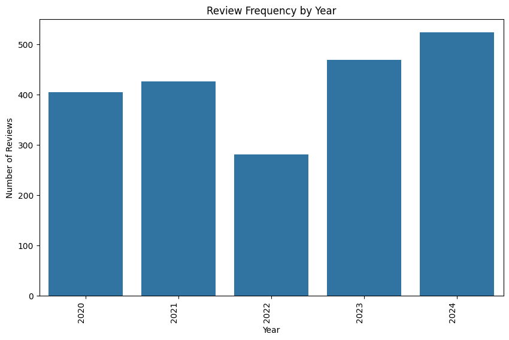

# Review Trend and Distribution

#### Quick Summary Plots

### Observations:
- There are spikes in reviews during the summer and winter besides the year 2022
- There is a general positive trend in reviews frequency, however, due to the fall in reviews in 2022, there exists a dip
- Most significant spike happens in August 2024; could further investigate the cause to that spike (special campaign, discount, etc)
- Cannot conclude if there is a seasonality or not due to high potential outliers

#### Distribution by Month

#### Distribution by Year

#### Distribution by Season

