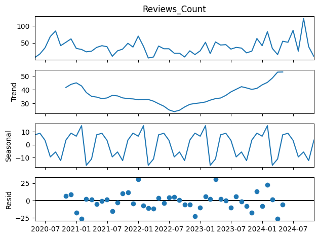
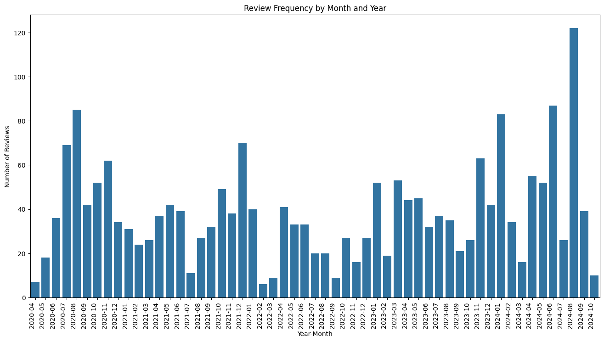

# Review Trend and Distribution

### Summary 
Understanding customer review trends is crucial for businesses to improve customer engagement and optimize marketing strategies. This project aims to analyze the frequency and distribution of customer reviews over time, identify seasonal patterns, and detect anomalies that could indicate marketing effectiveness or external influences (e.g., promotions, discounts).

### Results
- Observed spikes in reviews during summer and winter, except for 2022, which had a dip.
- Identified a significant review spike in August 2024, warranting further investigation into potential causes (e.g., special campaigns, discounts).
- Identified higher review counts in specific seasons, suggesting potential seasonality in review activity.
- General positive trend in reviews, indicating increasing engagement.
- Outliers present in the data make it challenging to confirm seasonality definitively.

### Technical Components 
- **Libraries Used:** Python (Pandas, NumPy, Matplotlib, Seaborn, Statsmodels)  
- **Time Series Decomposition:** Extracted trend, seasonality, and residuals from review counts.  
- **Data Visualization:**
    - Line plots for trend analysis.
    - Bar charts for review distributions by month, year, and season.  
    
    
    
- **Outlier Detection:** Identified spikes and dips to analyze external influences on review frequency.

### KPI in Place
- **Trend Analysis:** Detecting long-term growth or decline in review counts. 
- **Seasonality Patterns:** Identifying periods with higher/lower review frequency. 
- **Anomaly Detection:** Spotting sudden spikes or dips and correlating them with external factors (e.g., promotions, events). 
- **Data Quality & Accuracy:** Ensuring no missing or erroneous data skews the results.

### Best Practices Implemented
✔ **Data Cleaning & Preprocessing:** Removed inconsistencies and missing values. 
✔ **Time Series Decomposition:** Used statistical techniques to extract trends and seasonality. 
✔ **Multi-Angle Analysis:** Combined different visualizations (trend, seasonal decomposition, bar charts) to provide a holistic view. 
✔ **Investigative Approach:** Highlighted potential external factors influencing review trends.

